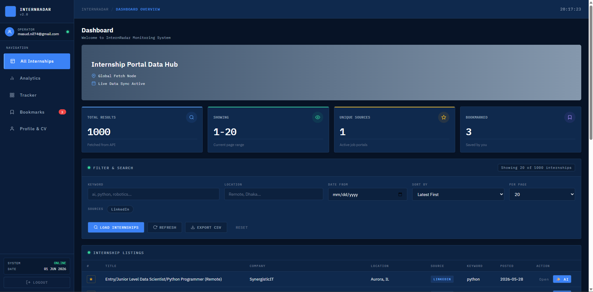
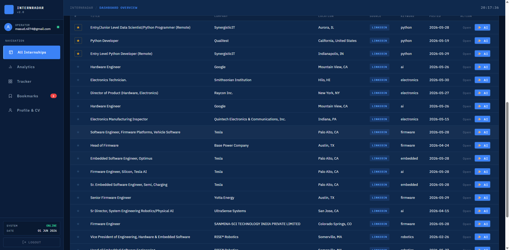
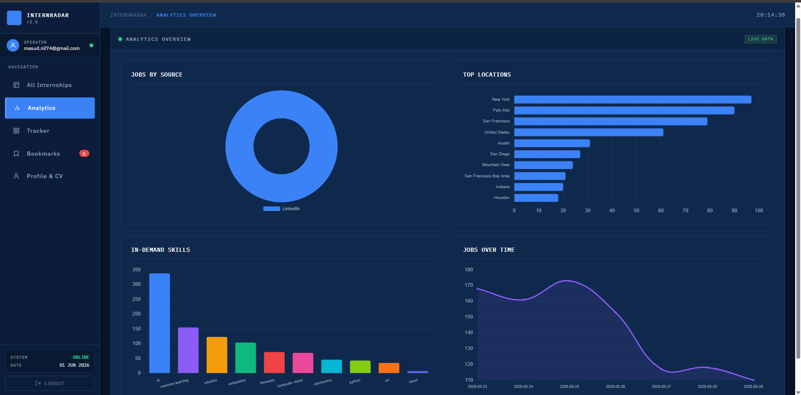
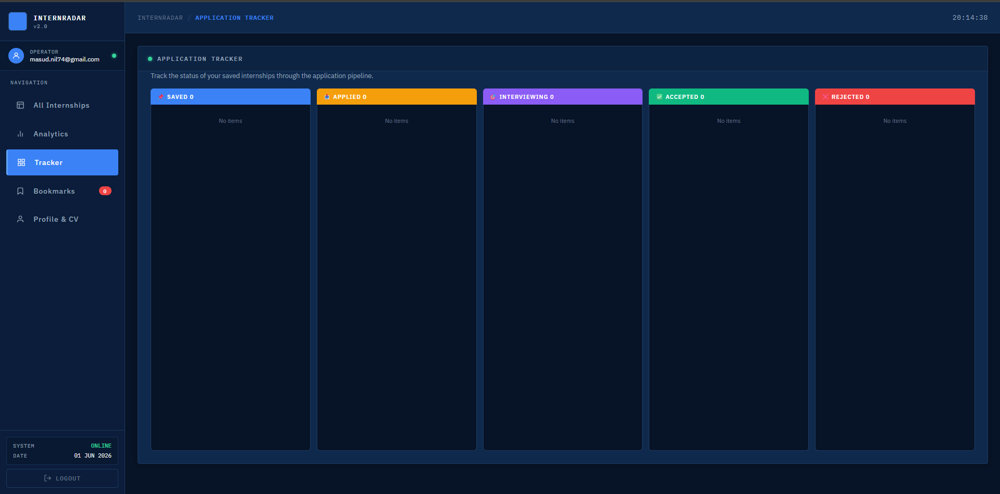
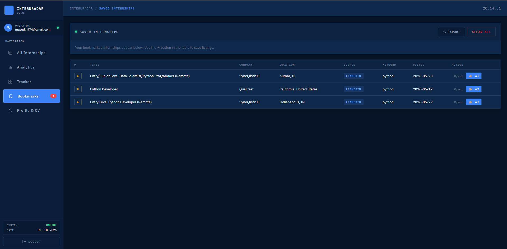
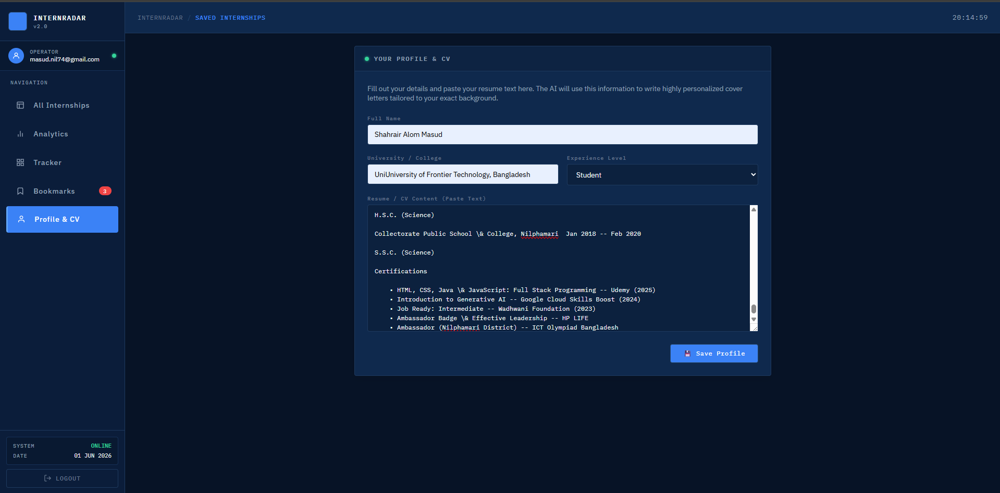
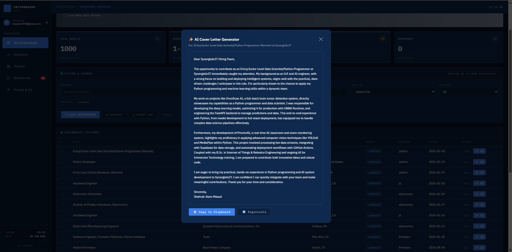
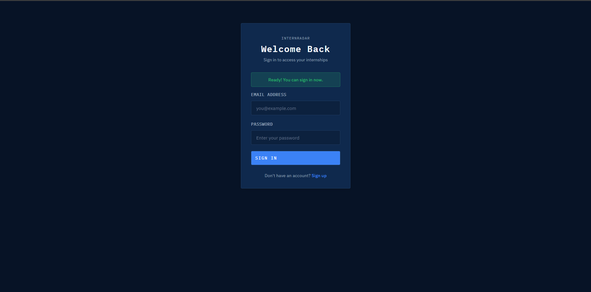
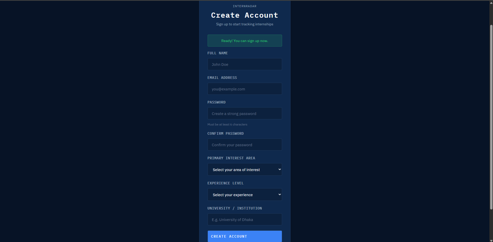
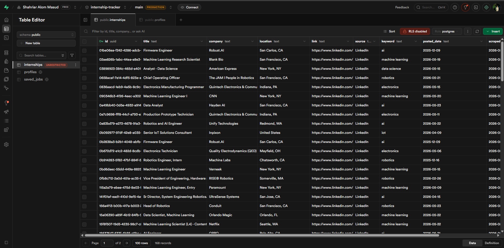

# Opportunity Pro (InternRadar & Scholarship Tracker Pro)

<p align="center">
  
  
  
  
  
  
  
  
</p>

<p align="center">
  Unified Global Platform for <strong>Upcoming Internships</strong>, <strong>Research Assistant (RA) Opportunities</strong>, and <strong>Fully Funded Masters & PhD Programs</strong> with built-in AI Cover Letter, Professor Cold Email &amp; Statement of Purpose (SOP) generator.
</p>

---

## 🎯 What's New & Upgraded

1. 🚀 **Upcoming Internships Track**: Real-time monitoring of upcoming and open global tech, embedded, SWE, and regional internships with stipend details and direct application portals.
2. 🔬 **Research Assistant (RA) Openings**: World-class lab openings (MIT, Stanford, Oxford, NUS, ETH Zurich, U of Toronto) with Professor names, research domains, funding, and direct contact portals.
3. 🏛️ **Funded Masters & PhD Scholarships Hub**: Merged with **Scholarship Tracker Pro** — complete database of 35+ fully funded scholarships (Erasmus Mundus, DAAD, MEXT, Fulbright, Singa, KAUST, Chevening, etc.) with match score ratings, eligibility, and benefits.
4. 🤖 **3-in-1 AI Career & Academic Suite**:
   - **AI Cover Letter Generator** (for Internships & Jobs)
   - **AI Professor Cold Email Generator** (tailored for RA positions with candidate resume alignment)
   - **AI Statement of Purpose (SOP) / Motivation Letter Generator** (for Masters & PhD programs)
5. 📋 **Application Kanban Pipeline**: Manage Saved, Applied, Interviewing, Accepted, and Rejected applications with status tracking.
6. 📊 **Interactive Analytics**: Real-time insights by track, country, research domain, and funding breakdown using Chart.js.

---

## 🏗️ System Architecture

**Data Flow:**
1. Frontend dynamically fetches opportunities via `/opportunities?category=internship|ra|masters_phd`.
2. Backend searches Supabase database or serves rich real-time curated datasets from top university labs and scholarship boards.
3. Users can bookmark listings, review detailed eligibility & benefits in popups, track status in Kanban, and export to CSV.
4. Integrated Gemini AI generates personalized Cover Letters, Cold Emails, and SOP drafts based on the applicant's resume.


---

## Features

### Frontend (User Dashboard)

| Feature                 | Description                                                |
| ----------------------- | ---------------------------------------------------------- |
| Real-time Data Hub      | Live internship fetching node with dynamic search.         |
| Advanced Filtering      | Filter opportunities by keyword, location, date, and source.|
| Bookmarking System      | Users can save internships to their personal profile.      |
| Pagination              | Efficient client-side navigation of large datasets.        |
| Professional Theme      | "Dark cards on a light background" with a sleek Hero Banner.|
| Authentication System   | Full login, signup, and password reset flows via Supabase. |

### Backend (FastAPI)

| Feature                 | Description                                                |
| ----------------------- | ---------------------------------------------------------- |
| Fast Data Aggregation   | Asynchronous data fetching across job sources.             |
| Search & Querying       | Flexible endpoint parameters (`limit`, `keyword`, `location`).|
| Security                | Configured CORS for Netlify frontend integration.          |

---

## Project Structure

```
InternRadar/
│
├── backend/                         # FastAPI backend
│   ├── main.py                      # FastAPI app + CORS + router registration
│   ├── models.py                    # Pydantic models 
│   ├── supabase_client.py           # Supabase DB integration logic
│   ├── schema.sql                   # Database table definitions
│   └── requirements.txt             # Backend dependencies
│
├── frontend/                        # Web dashboard (Static HTML/CSS/JS)
│   ├── index.html                   # Main Monitoring Dashboard
│   ├── login.html                   # Login Page
│   ├── signup.html                  # Registration Page
│   ├── forgot-password.html         # Password Reset Request
│   ├── reset-password.html          # Password Reset Form
│   ├── styles.css                   # Global styles & Color Variables
│   ├── app.js                       # Core dashboard logic (fetching, filtering)
│   └── supabase-lib.js              # Supabase Auth integration logic
```

---

## Screenshots

### Dashboard Overview


Shows the main internship listings, hero banner, search filters, and real-time statistics.

### Analytics & Tracking



Comprehensive analytics overview and a kanban-style application tracker for saved internships.

### Profile & AI Features


Manage your profile and generate tailored cover letters using Gemini AI.

### Authentication Flow



Secure authentication pages utilizing the dark card on light background theme.

---

## Technology Stack

### Backend
| Tool                | Purpose                          |
| ------------------- | -------------------------------- |
| FastAPI             | REST API framework               |
| Python 3.10+        | Core backend language            |
| Uvicorn             | ASGI server                      |
| Render              | Cloud deployment                 |

### Frontend
| Tool               | Purpose                                       |
| ------------------ | --------------------------------------------- |
| HTML5 / CSS3       | Structure and styling (Vanilla CSS variables) |
| Vanilla JavaScript | API calls, state management, UI rendering     |
| Netlify            | Static site hosting with auto-deploys         |

### Database & Auth
| Tool          | Purpose                                                  |
| ------------- | -------------------------------------------------------- |
| Supabase      | PostgreSQL database + built-in Auth system               |
| Supabase Auth | Email/password login, token management                   |

---

## How It Works

### Step 1 — Authentication
Users authenticate via the `login.html` or `signup.html` pages. The frontend communicates directly with Supabase via `supabase-lib.js`. Session tokens are stored in `localStorage`.

### Step 2 — Data Fetching
Upon successful login, `app.js` initializes the dashboard. It fires a `GET` request to `https://internrader-backend.onrender.com/internships`. 

### Step 3 — Filtering & Interaction
When a user types a keyword or selects a source (e.g., LinkedIn), the dashboard dynamically appends query parameters to the API request, retrieving tailored results. Users can click the bookmark icon on any row to save that internship ID to their Supabase profile.

---

## API Reference

**Base URL:** `https://internrader-backend.onrender.com`

| Method | Endpoint                | Description                            |
| ------ | ----------------------- | -------------------------------------- |
| GET    | `/health`               | API health check                       |
| GET    | `/internships`          | Fetch internships (Query params available) |
| GET    | `/sources`              | Fetch available job sources            |

### GET /internships — Example Request
```http
GET /internships?limit=20&keyword=python&location=remote
```

---

## Database Schema



```sql
create table profiles (
  id uuid references auth.users not null primary key,
  full_name text,
  student_id text,
  created_at timestamp with time zone default timezone('utc'::text, now()) not null
);

create table bookmarks (
  id bigint generated by default as identity primary key,
  user_id uuid references auth.users not null,
  internship_id text not null,
  internship_title text,
  company text,
  created_at timestamp with time zone default timezone('utc'::text, now()) not null,
  unique(user_id, internship_id)
);
```

*(Note: Row Level Security (RLS) is enabled to ensure users can only see their own bookmarks.)*

---

## Deployment

### Frontend — Netlify
- Connected via GitHub integration.
- Pushes to the `main` branch automatically trigger a deploy.
- Live URL: `https://internrader.netlify.app`

### Backend — Render
- Hosted on Render Web Services.
- Start command: `uvicorn backend.main:app --host 0.0.0.0 --port $PORT`
- Live URL: `https://internrader-backend.onrender.com`

---

## Author

Shahriar Alom Masud  
B.Sc. Engg. in IoT & Robotics Engineering  
University of Frontier Technology, Bangladesh  
Email: shahriar0002@std.uftb.ac.bd  
LinkedIn: [https://www.linkedin.com/in/shahriar-alom-masud](https://www.linkedin.com/in/shahriar-alom-masud)

---

## License

See [LICENSE](LICENSE) file for full MIT License details.
